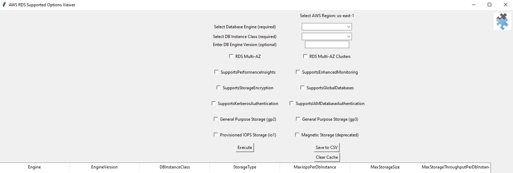
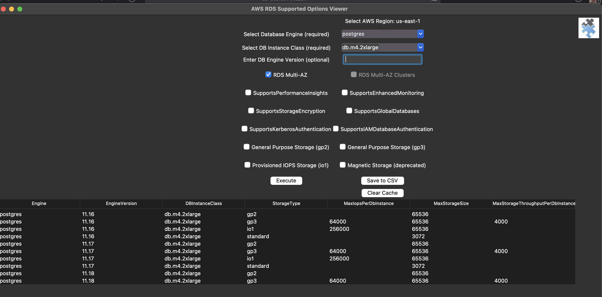

# AWS RDS Configuration Options Viewer

## Description
The AWS RDS Configuration Options Viewer is a Python-based GUI tool designed to simplify the exploration of AWS RDS instance configurations. By integrating directly with the AWS SDK, it fetches real-time data about available engines, instance classes, and other related configurations. Whether you're an AWS newbie looking to understand RDS offerings or an expert aiming to streamline your workflow, this tool has got you covered.

### Use Cases:
- Quickly understand the AWS RDS offerings without having to navigate through the AWS Management Console or documentation.
- Extract and save configurations for documentation or analysis.
- Compare and analyze various instance configurations for capacity planning and cost estimation.
- Validate supported configurations at the AWS API level via a simple GUI interface.

### Features

- **Region Selection**: Choose from various AWS regions to explore their specific RDS configuration options.
- **Cache Support**: For a faster experience, frequently accessed data is cached. Cache is region-specific to ensure accuracy.
- **Export to CSV**: Conveniently export the fetched configuration details to a CSV file for further analysis.
- **Clear Cache**: Ability to clear cache for the selected region with just a click.
- **GUI Interface**: A user-friendly GUI to simplify interactions.

#### Example main application screenshot




### Demo video for v1.0

https://github.com/SeanOzzy/aws_rds_config_options_viewer/assets/114792501/8fd960f1-185d-4736-a8a9-394387bbdbd3
**Note**: This video contains no audio by design.

### Usage

1. **Run the Application**:
   ```sh
   python rdsConfigViewer.py
   ```

2. **Select a Region**: Upon starting the application, a prompt will appear to select a desired AWS region. The first time you select a region the application needs to fetch the supported DB engines and DB instance types which will be populated to the cache. DB engines and instance types are relatively static so the default cache retention is 7 days, this can be customised in config/constants.py as required. Typically fetching the data initially takes 2-4 minutes.

3. **Explore Configuration Options**: After selecting a region, explore the various RDS configuration options available for that region.

4. **Verify the Valid Combinations**: Select the DB engine and DB instance type (required) and optionally the engine version or one or more of the checkboxes and click "Execute", if your selections are supported a list will be populated, if no data is returned the selected options are not supported.

5. **Export Data**: Click the "Save to CSV" button to export the displayed data to a CSV file.

6. **Clear Cache**: If needed, you can clear the cache for the selected region using the "Clear Cache" button. A valid reason to clear the cache is after AWS releases a new RDS engine or DB instance type in the region. You can see What's New with the AWS Database services via their [What's New page](https://aws.amazon.com/about-aws/whats-new/database/?whats-new-content.sort-by=item.additionalFields.postDateTime&whats-new-content.sort-order=desc&awsf.whats-new-products=*all).

## Installation & Requirements

### Requirements

1. Python 3.10.x or higher. For further information see:
    a. [Using Python on a Mac](https://docs.python.org/3/using/mac.html)
    b. [Using Python on Windows](https://docs.python.org/3/using/windows.html)
2. Valid credentials with permissions to access the AWS RDS service. For information on configuring credentials see the [AWS Boto3 credentials documentation](https://boto3.amazonaws.com/v1/documentation/api/latest/guide/credentials.html)

### Installing the application
1. Clone the repository or download and unpack the zip package.
2. Navigate to the root directory of the application.
3. Configure a Python virtual environment to keep the required packages from cluttering your system.
    - **macOS**
    For macOS you need to install tkinter with Tcl/Tk via ```brew install python-tk@3.10```, see [Idle and tkinter on macOS](https://www.python.org/download/mac/tcltk/).
    ```bash
    pip install virtualenv
    python -m venv /path/to/new/virtual/aws_rds_config_options_viewer
    /path/to/aws_rds_config_options_viewer/bin activate
    ```

    - **Windows**
    ```bash
    pip install virtualenv
    python -m venv c:\path\to\aws_rds_config_options_viewer
    cd c:\path\to\aws_rds_config_options_viewer
    Scripts\activate
    ```
4. Install the required Python packages using:
    ```bash
    pip install -r requirements.txt
    ```
5. Run the application using:
    ```bash
    python rdsConfigViewer.py
    ```

## Application Structure Overview

- **config**: Contains configuration files.
    - `constants.py`: Holds various constants and configurations. Customize AWS regions, cache settings, and more here.
    - `rds_endpoints.py`: Endpoint details for the AWS regions. 
- **gui**: Contains files related to the graphical user interface.
    - `widgets.py`: Defines individual widgets and components of the GUI.
- **utils**: Utility scripts and helper functions.
    - `aws_api.py`: Functions related to AWS API calls.
    - `cache.py`: Caching mechanism to store and retrieve data.
    - `data_processing.py`: Processes data for display on the GUI.
    - `logger.py`: Logging mechanism used to populate the log file with your selections and any other useful information.
    - `rdsConfigViewer.py`: Entry point for the application. Initiates the GUI and starts the application.

## Contribute

Contributions, issues, and feature requests are welcome! Feel free to check the [Issues](https://github.com/SeanOzzy/aws_rds_config_options_viewer/issues) page.

## License

This software is provided under the MIT license. No warranties or liabilities are accepted. For detailed licensing information, refer to the [LICENSE](LICENSE) file.

## Disclaimer
Amazon Web Services do not endorse, warrant or accept any liability for using this package. This is a personal portfolio project shared with the aim to assist AWS RDS users and to continue my Python learning journey.

## Acknowledgements
This application depends on the AWS Boto3 API's [describe_db_engine_versions](https://boto3.amazonaws.com/v1/documentation/api/latest/reference/services/rds/client/describe_db_engine_versions.html) and [describe_orderable_db_instance_options](https://boto3.amazonaws.com/v1/documentation/api/latest/reference/services/rds/client/describe_orderable_db_instance_options.html).

## FAQ
1.  I see security token invalid errors.
    Check that your AWS credentails are configured correctly and that you have access to the region you selected. If you wish to identify RDS regions accessible for your account you can obtain a list via the [describe_source_regions](https://boto3.amazonaws.com/v1/documentation/api/latest/reference/services/rds/client/describe_source_regions.html) API.

2.  I don't see the expected database engines in the Database Engine list dropdown.
    You likely the credentials you are passing when running the application do not have permission to launch the DB engine you are missing, the engine list and db instance class list are created programatically by fetching the options available for the account, region and credentials you are using.
